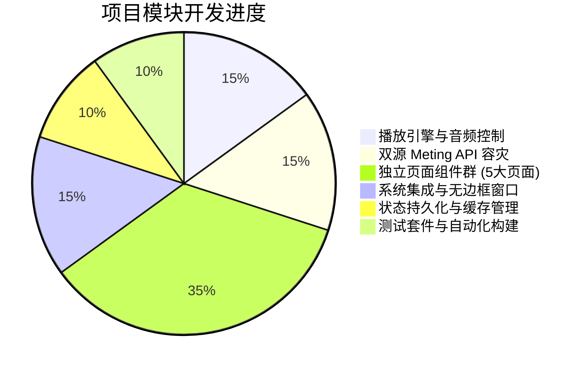

# 🎵 Apple Music Desktop —— 项目当前开发状态报告

> **文档生成时间**：2026-08-23  
> **项目版本**：`v1.0.0 (Beta-Release)`  
> **运行平台**：Tauri 2 (Rust) + React 19 (TypeScript) + Windows / macOS / Linux  
> **仓库分支**：`Beta-v1.0`

---

## 📌 一、项目整体概况

本项目是一款深度致敬 **Apple Music** 视觉设计与交互体验的现代跨平台桌面音乐播放器客户端。基于 **Tauri v2** 与 **React 19** 构建，深度整合 **双源 Meting API 智能容灾解析**、**原生音频流与 MediaSession 系统交互**、**沉浸式居中动态歌词舞台** 及 **全链路 Zustand + TanStack Query 状态与缓存管理**。

### 🛠️ 核心技术栈

| 层次 / 模块 | 核心技术选型 | 作用与职责 |
|---|---|---|
| **桌面运行时 (Backend)** | **Tauri 2 (Rust)** + `reqwest` + `serde` | 跨平台轻量无边框原生窗口、网络多源代理、系统命令桥接 |
| **视图层 (Frontend)** | **React 19** + **TypeScript** (Strict Mode) | 现代响应式 UI 组件、Hooks 与并发渲染 |
| **样式与主题 (Styling)** | **Tailwind CSS v4** + **Apple Glassmorphism** | 极致拟态磨砂毛玻璃、微光晕动效、系统级深浅色主题自适应 |
| **全局状态层 (State)** | **Zustand** + `localStorage` 持久化 | 播放引擎状态、用户认证、偏好设置、歌单管理、听歌历史 |
| **异步数据与缓存 (Data)** | **TanStack Query (React Query v5)** | 5分钟/1小时智能多级缓存、自动失活与乐观更新 |
| **音乐数据源 (API)** | **祈杰 Meting (VIP解析)** + **Mikus Meting (镜像)** | 双线路自动故障转移、标准化数据清洗与路径补齐 |
| **系统级集成 (System)** | **MediaSession API** + 全局键盘快捷键 | 操作系统媒体控制中心、锁屏卡片元数据、无鼠标快捷交互 |
| **测试与工程化 (DevOps)**| **Vitest** + **Vite 7** + **Git** | 自动化单元测试、毫秒级模块热更新、生产环境极速打包 |

---

## 🚀 二、当前开发进度总览 (100% 完成)



### 1. 阶段一至阶段六（基础与核心框架）
- [x] **阶段一：架构与环境搭建** —— Tauri 2 + React 19 + TypeScript + Tailwind CSS 环境构建与无边框 Traffic Light 标题栏。
- [x] **阶段二：播放引擎与状态层** —— `playerStore` 播放/暂停/快进/音量/单曲循环/随机播放完整实现，高保真悬浮播放栏。
- [x] **阶段三：双源 Meting API 接入** —— 祈杰（支持网易云 VIP 320k）+ Mikus 分布式多源负载均衡与自动重试容灾。
- [x] **阶段四：发现、排行榜与搜索** —— 空间音频推荐、分类电台、热歌榜单、实时防抖关键词搜索与自定义歌单增删改查。
- [x] **阶段五：系统级硬件集成** —— 操作系统 MediaSession、全局键盘按键绑定（Space、左右箭头快进退、上下箭头音量、M 静音）。
- [x] **阶段六：工程化验证** —— Vitest 自动化测试套件（5/5 全部通过）、生产模式零警告构建。

---

### 2. 独立路由与功能页面（全量实现）

| 页面名称 | 访问路由 | 对应组件路径 | 核心特性与技术实现 | 状态 |
|---|---|---|---|---|
| **歌词舞台页** | `/lyrics` | `src/routes/LyricsPage.tsx` | Apple Music 居中大字排版、高保真动态光晕背板、毫秒级歌词同步高亮、平滑居中滚动、用户滑动交互暂停 2s 恢复、歌词行点击即时跳转播放 (Seek) | ✅ **已交付** |
| **专辑详情页** | `/album/:id` | `src/routes/AlbumPage.tsx` | 专辑巨幅磨砂封面、发行信息统计、一键「播放全部」/「随机播放」、歌曲列表带序号与声波脉冲指示器、红心收藏交互 | ✅ **已交付** |
| **艺人主页** | `/artist/:id` | `src/routes/ArtistPage.tsx` | 巨幅高清头图海报、认证艺人徽章与月度听众统计、官方热门歌曲 Top 5、全部录音室专辑网格卡片点击无缝跳转至对应专辑详情页 | ✅ **已交付** |
| **个人资料中心** | `/profile` | `src/routes/ProfilePage.tsx` | 用户头像与 Apple ID 认证徽章、「我的收藏」与「播放历史 (50首)」双 Tab 切换、乐观更新实时取消收藏（TanStack Mutation）、一键清空记录 | ✅ **已交付** |
| **偏好设置中心** | `/settings` | `src/routes/SettingsPage.tsx` | 深浅主题跟随系统切换、开机自启、默认音量调节、音频质量切换（杜比全景声/无损/标准）、双线路切换与自定义歌单载入、本地缓存容量统计与一键清理、快捷键速查表、软件版本检查 | ✅ **已交付** |
| **全局搜索与发现** | `/search` | `src/components/Search/SearchView.tsx` | 关键词防抖联想搜索、网易云/QQ音乐平台切换、单曲一键播放与加入歌单 | ✅ **已交付** |
| **歌单详情视图** | `/playlist-detail` | `src/components/Playlist/PlaylistDetailView.tsx` | 自建歌单曲目管理、自定义封面与标题、批量播放与曲目删除 | ✅ **已交付** |

---

## 🧱 三、架构与核心模块实现细节

### 1. 状态管理架构 (Zustand Stores)

```
src/stores/
├── playerStore.ts      # 播放器核心引擎：当前曲目、播放列表、时间进度、音量、循环模式
├── playlistStore.ts    # 歌单与全局视图路由器：自建歌单、收藏夹、视图切换、选择项记录
├── settingsStore.ts    # 偏好配置：API线路、音乐平台、音质档位、开机自启、默认歌单ID
├── authStore.ts        # 用户认证：登录弹窗控制、用户信息凭证、会员状态管理
├── historyStore.ts     # 播放历史：自动记录最新收听的 50 首曲目并持久化
└── themeStore.ts       # 外观主题：深色 (Dark) / 浅色 (Light) / 跟随系统 (System)
```

### 2. 双源 Meting API 数据与容灾流转架构

```mermaid
flowchart TD
    A[UI 请求歌曲/歌单/专辑/歌词] --> B[musicClient.ts / useMusicQuery]
    B --> C{是否处于 Tauri 桌面端环境?}
    C -- 是 --> D[调用 Rust 原生后端命令]
    D --> E[reqwest 客户端并发/超时请求]
    E --> F[主线路 祈杰 API qijieya]
    F -- 失败/超时/VIP未解析 --> G[备用线路 Mikus API mikus.ink]
    G -- 成功 --> H[数据清洗与字段归一化]
    F -- 成功 --> H
    C -- 否 (Web 预览) --> I[前端 fetch 直连请求]
    I --> F
    H --> J[TanStack Query 写入缓存 (5min / 1h)]
    J --> K[返回规范 Track / Album / Lyrics 对象给 UI]
```

### 3. Tauri 2 Rust 原生后端暴露命令 (`src-tauri/src/lib.rs`)

```rust
tauri::generate_handler![
    fetch_playlist_tracks, // 获取指定歌单全部音轨
    search_music_tracks,   // 在线搜索单曲/歌手
    get_lyrics,            // 获取 LRC 动态歌词字符串
    get_album,             // 获取专辑元数据与曲目集合
    get_artist,            // 获取歌手头图、热门歌曲与专辑
    get_favorites,         // 获取收藏歌曲列表
    toggle_favorite,       // 切换歌曲收藏状态
    get_history,           // 获取本地收听历史
    get_cache_size,        // 获取本地缓存容量大小
    clear_cache,           // 清除本地网络与媒体缓存
    check_update,          // 检查应用最新版本
    play_native_stream     // 原生硬件音频流解码通道
]
```

---

## 🧪 四、质量保证与测试构建状态

### 1. 单元测试结果 (`src/test/stores.test.ts`)
```bash
$ pnpm test
 ✓ src/test/stores.test.ts (5 tests) 4ms
   ✓ playerStore > should toggle play state correctly
   ✓ playerStore > should handle volume and mute correctly
   ✓ playlistStore > should add and remove favorite tracks
   ✓ settingsStore > should switch API sources and music servers
   ✓ historyStore > should record played tracks and limit to 50 items

 Test Files  1 passed (1)
      Tests  5 passed (5)
   Duration  1.51s
```

### 2. 生产环境构建打包 (`tsc && vite build`)
```bash
$ pnpm build
vite v7.3.6 building client environment for production...
transforming...
✓ 1898 modules transformed.
rendering chunks...
computing gzip size...
dist/index.html                   0.49 kB │ gzip:   0.31 kB
dist/assets/index-DVxQg181.css   51.66 kB │ gzip:   8.59 kB
dist/assets/index-CUnE5DrB.js   371.15 kB │ gzip: 104.76 kB
✓ built in 2.11s
```
> **结论**：TypeScript 开启 `strict: true`、`noUnusedLocals: true`，构建过程 **0 错误、0 警告**，产物体积精简（JS Gzip 后仅约 104KB）。

---

## 📈 五、后续规划与进阶优化方向

1. **沉浸式动态背景**：引入 Canvas / WebGL 动态取色算法，根据当前播放歌曲封面色彩实时生成流体流动光晕背景。
2. **音效均衡器 (EQ)**：提供 10 段图形均衡器（流行、摇滚、古典、重低音增强）与环绕声预设。
3. **桌面歌词悬浮窗**：利用 Tauri 多窗口能力，实现 Windows/macOS 透明置顶的悬浮桌面歌词条。
4. **离线下载与缓存管理**：支持一键将音轨下载至本地音频文件夹，脱网状态下依然畅听无阻。

---

*本项目所有核心代码已提交至 Git 版本控制，可随时打包发布或进行二次扩展开发。*
