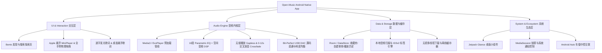

# 📱 Open-Music Android 原生深度演进与架构规划档案

> **文档版本**：v1.0 (Archived Plan)  
> **分支归属**：`android-native`  
> **核心技术栈**：Kotlin + Jetpack Compose + Material 3 + AndroidX Media3 (ExoPlayer) + StateFlow Coroutines

---

## 🏗️ 总体技术架构与演进全景



---

## 🎯 7 大高阶演进维度详解

### 🎛️ 维度一：专业级 Hi-Fi 音频引擎与 DSP 调音
1. **Bit-Perfect 源码输出 / Direct DAC 直通**：
   - 绕过 Android 系统的 AudioFlinger 强制 48kHz 重采样，支持外接 USB DAC 解码耳放输出 **24-bit / 96kHz ~ 192kHz** 母带级真无损。
2. **专业 10 段/31 段 Parametric EQ 均衡器与空间音频**：
   - 基于 `Android OpenSL ES` 或 `DynamicsProcessing` 实现图形均衡器、低音增强（Bass Boost）、混响与虚拟 3D 空间环绕。
3. **无缝播放（Gapless Playback）与交叉淡入淡出（Crossfade 0~12s）**：
   - 切歌时上一首渐隐、下一首渐显，演唱会/概念专辑无缝衔接。
4. **ReplayGain 响度自适应标准化**：
   - 自动平衡不同歌曲音量大小，防止切歌时突然爆音。

---

### 🎤 维度二：下一代歌词引擎
5. **Apple Music 风格「逐字精准发光歌词」（Word-by-word TTML/SYLT）**：
   - 歌词不再只是整行滚动，而是每个字跟随音节发光、平滑放大推进，并带有流光粒子微动效。
6. **系统级桌面悬浮歌词（Floating Window Lyrics）**：
   - 开启画中画悬浮窗，在微信、看小说、玩游戏时常驻屏幕，支持双行、调字体/透明度、锁定防误触。
7. **状态栏歌词集成（Status Bar Lyrics）**：
   - 深度适配主流国产系统（小米 HyperOS / 魅族 Flyme / 三星 OneUI / 原生 Android）的状态栏滚动歌词。

---

### 📱 维度三：Android 深度生态与桌面组件
8. **Jetpack Glance 桌面小组件（App Widgets）**：
   - **4×2 大画幅 Bento 极光封面微件**（支持实时歌词与大波形）；
   - **2×2 / 4×1 极简控制胶囊微件**（支持根据专辑封面实时提取 Material You 色彩）。
9. **Android Auto 车载互联模式**：
   - 接入 `MediaLibraryService`，连上汽车中控大屏即可直接选歌、播放歌单。
10. **下拉通知栏快捷磁贴（Quick Settings Tile）**：
    - 在控制中心添加一个一键播放/暂停或随机切歌的快捷磁贴。

---

### 📂 维度四：本地音乐与全盘元数据引擎
11. **本地音频扫描与 ID3v2 标签编辑（Local Music Scanner & Tag Editor）**：
    - 全盘扫描手机存储中的 MP3 / FLAC / WAV / ALAC / DSD 音频；
    - 自动提取内嵌封面、歌词、内嵌元数据，支持手动刮削补全歌手封面与专辑介绍。
12. **离线缓存与无损多线程下载器**：
    - 支持边听边存无缝缓存到本地私有目录，在地铁、飞机等无网环境下秒开播放。
13. **歌单导入/导出（.m3u / .m3u8 与第三方歌单链接一键同步）**。

---

### 📡 维度五：多端互联与云端投屏
14. **DLNA / Google Cast / AirPlay 无线投屏串流**：
    - 将手机正在播放的高保真流媒体直接投送到客厅电视、Sonos、HomePod 或音箱设备。
15. **WebDAV / SMB / 个人私有云盘直连**：
    - 支持直接挂载播放阿里云盘、百度网盘、OneDrive 或家里 NAS 里的庞大无损曲库。

---

### 👆 维度六：全手势物理感知交互（Gesture Physics）
16. **流畅手势交互**：
    - 播放器手势下拉物理阻尼收起、上滑展开；
    - 封面左右物理摩擦惯性滑动切歌；
    - 旋转唱片手势搓动精准快进/快退。
17. **定时睡眠与心流倒计时（Sleep Timer）**：
    - 智能倒计时、听完本首歌后停止、逐渐降低音量温柔入睡。

---

### ⚡ 维度七：底层网络与极致预加载
18. **ExoPlayer 预加载缓存策略（Preloading & Buffer Optimization）**：
    - 播放当前歌曲时提前在后台静默预拉取下一首歌曲的前 1MB 音频流切片，实现 **0 延迟瞬时切歌**。

---

## 📋 5 个分阶段实施建议方案

| 阶段 | 阶段主题 | 核心功能与交付成果 |
|---|---|---|
| **阶段 1** | **核心体验闭环与数据持久化** | 🔍 移动端跨源搜索与 Bento 发现页 + 💾 离线收藏/自建歌单 + 🔔 MediaSession 锁屏媒体控制 |
| **阶段 2** | **全手势物理交互与视觉前沿** | 🎵 悬浮 Mini 播放栏与全手势无级拖拽展开 + ✨ Palette 封面动态流光与 Liquid Glass + ⏲️ 定时睡眠 |
| **阶段 3** | **下一代歌词引擎** | 🎤 Apple Music 逐字发光歌词 + 🪟 全局桌面悬浮歌词窗 + 📟 状态栏歌词广播集成 |
| **阶段 4** | **专业 Hi-Fi 音频引擎与 DSP** | 🎛️ 10 段图形均衡器与 3D 空间环绕 + 🔀 无缝播放与 Crossfade 交叉渐变 + ⚡ 预加载秒开 |
| **阶段 5** | **本地音乐管理与深度生态** | 📂 全盘本地音频扫描器与 ID3v2 标签 + 📥 离线多线程下载 + 🖼️ Jetpack Glance 桌面组件 + 🚗 Android Auto |

---

## 🛠️ 推荐依赖清单

```kotlin
// build.gradle.kts (app)
dependencies {
    // 1. Room 数据库持久化
    val roomVersion = "2.6.1"
    implementation("androidx.room:room-runtime:$roomVersion")
    implementation("androidx.room:room-ktx:$roomVersion")

    // 2. Palette 封面色彩提取
    implementation("androidx.palette:palette-ktx:1.0.0")

    // 3. Navigation & 扩展图标库
    implementation("androidx.navigation:navigation-compose:2.7.7")
    implementation("androidx.compose.material:material-icons-extended:1.6.1")

    // 4. Jetpack Glance 桌面小组件
    val glanceVersion = "1.0.0"
    implementation("androidx.glance:glance-appwidget:$glanceVersion")
    implementation("androidx.glance:glance-material3:$glanceVersion")

    // 5. Media3 OkHttp 数据源
    implementation("androidx.media3:media3-datasource-okhttp:1.2.1")
}
```
